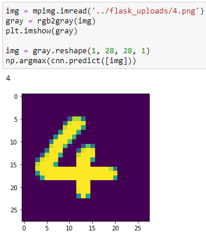

# ImageClassification
Image Classification using Convolution Neural Networks in Tensorflow. The application is intgrated with a basic Flask web UI that allows users to upload and test on their custom image. The model is trained on the famous MNIST dataset. MNIST is a dataset of handwritten digits from 0-9 and is widely used as "Hello World" to Image Classification.

The repository contains detailed Jupyter notebook for training the model along with flask boiler code to integrate the model.
You can find the notebooks under [Jupyter](https://github.com/deepme987/ImageClassification/tree/master/Jupyter) directory and pre-trained models in [models](https://github.com/deepme987/ImageClassification/tree/master/Models) section.

*If you would like to try the model on-the-fly, visit [here](Link to be added)*

Sample Image:

## Required Libraries:
- flask
- tensorflow
- matplotlib
- numpy

---
### How to use the Image Classification on your local server:

**1. Clone the repository to your directory:**

&nbsp;&nbsp; `git clone https://github.com/deepme987/ImageClassification.git`
 
**2. Install the required libraries:**
  
&nbsp;&nbsp;&nbsp;&nbsp; `pip install requirements.txt`
    
**3. Once all the files are ready, run the flask on localhost:**

&nbsp;&nbsp; `python runner.py`

**4. Upload an image and get instant results**
